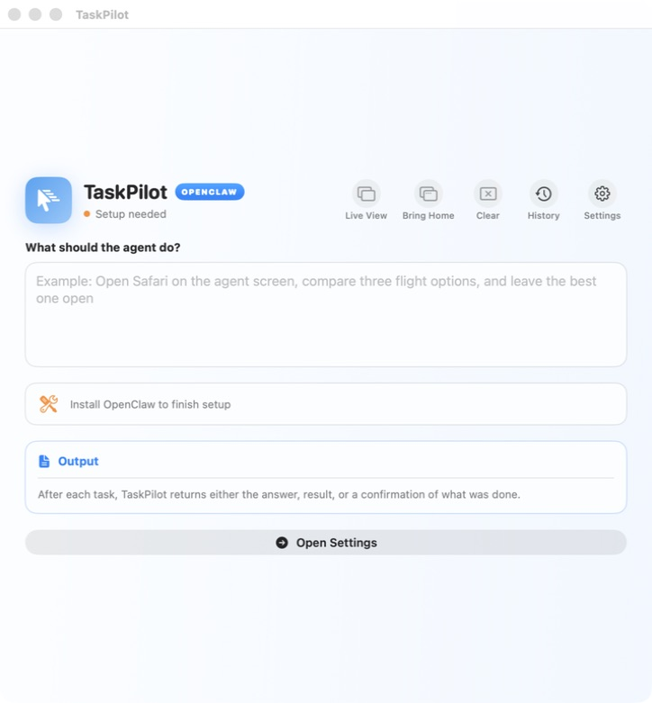
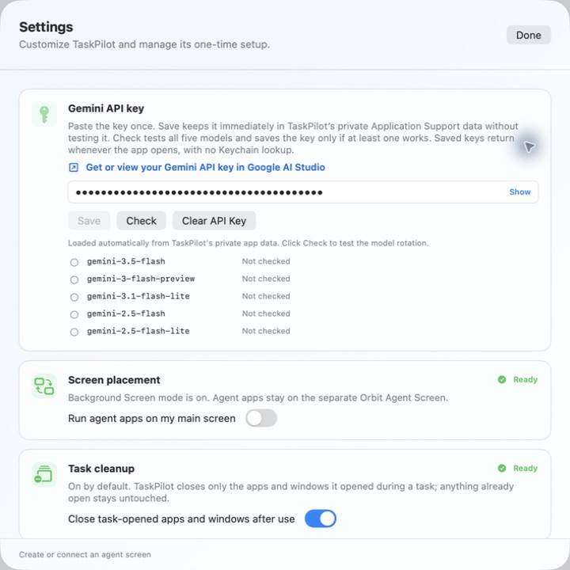

# TaskPilot

## Open it

To use TaskPilot, double-click `TaskPilot.app` beside this README. It is right here at the first level, so you do not have to dig through the project files.

To open the code, open `ProjectFiles` and double-click `Package.swift`. Choose Xcode if your Mac asks what should open it, then click the Run button. No weird Terminal setup just to look around.

## How it works

TaskPilot gives an AI its own Mac screen. You type a task, it looks at that screen, and then it uses normal apps one careful action at a time. You can watch the work, pause it, or take over if something feels weird. It is like giving a robot its own desk instead of letting it grab your whole computer.

*The main screen is simple: write what you want, then let TaskPilot work where you can see it.*

## Why it is different

Most AI computer tools feel like a chat box that disappears in the background. TaskPilot makes the computer work visible. It checks actions before they happen; you can see what changed and stop the task whenever you want. That separate screen is the part I keep coming back to because it makes the whole idea feel much less mysterious.

## What it is made with

- Swift and SwiftUI handle the app window, controls, settings, queue, and history.
- macOS Accessibility and process-targeted events let it click, type, scroll, and move windows.
- ScreenCaptureKit captures only the screen assigned to the task.
- A small Python bridge talks to OpenClaw, which handles the AI reasoning.
- BetterDisplay can create a virtual second screen, but a real monitor works too.

These are all learnable tools. A college intern could build a small version; the hard part is adding enough safety checks so the agent stays in the right window and does not do something random.

## Where everything lives

The first folder level has the ready-to-open `TaskPilot.app`, this README, and the `ProjectFiles` folder. Everything used to build the app lives inside that folder.

- `ProjectFiles/Sources/OrbitAgent` contains the Swift app.
- `ProjectFiles/AgentRuntime` contains the small Python reasoning bridge.
- `ProjectFiles/Resources` and `ProjectFiles/Scripts` contain setup and build helpers.
- `ProjectFiles/Tests` checks the Swift app, Python bridge, and OpenClaw setup.
- `ProjectFiles/Documentation` contains the deeper project map and pictures.

There is a slightly deeper, still readable map in [ProjectFiles/Documentation/Architecture.md](ProjectFiles/Documentation/Architecture.md).

## Setup

Open Settings, add a Gemini key, install OpenClaw, connect an agent screen, and allow the macOS permissions. The Settings page keeps the setup in one place.

*The key is hidden here. Settings also shows the screen, OpenClaw, notifications, and permission status.*

You need macOS 14 or newer, Xcode Command Line Tools, and Python 3.11.
